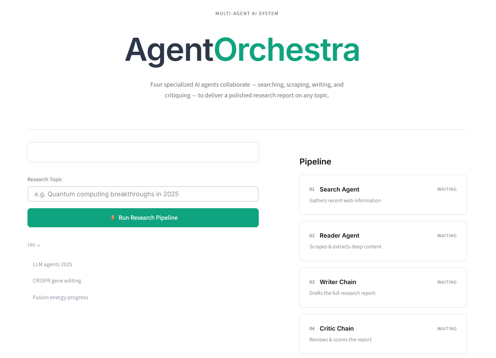

<div align="center">
  <h1>✦ Agent Orchestra ✦</h1>
  <p><strong>An Autonomous Multi-Agent Research System</strong></p>
</div>

<p align="center">
  
  
  
  
</p>


Live Demo: [https://agentorchestra.streamlit.app/](https://agentorchestra.streamlit.app/)

## 🚀 Overview

**Agent Orchestra** is a powerful multi-agent AI system built with [Streamlit](https://streamlit.io/) and [LangChain](https://python.langchain.com/). It leverages four specialized AI agents acting in concert to autonomously search, scrape, synthesize, and review information. The result is a polished, highly detailed research report on any given topic, delivered natively alongside interactive AI critique.

Say goodbye to manual web searching and compiling. Enter your topic, and watch the orchestrated agents collaborate entirely in real-time.

## ✨ Features

- **Four-Stage Orchestration Pipeline**: 
  1. **Search Agent 🔍**: Uses the Tavily Search API to gather the most recent, reliable, and highly relevant web data based on the input topic.
  2. **Reader Agent 📄**: Intelligently targets the best URLs from the search results, deep-scraping them to extract dense, meaningful context.
  3. **Writer Chain ✍️**: Assesses the scraped data and drafts a comprehensive, well-structured Markdown report.
  4. **Critic Chain 🧐**: An automated reviewer that critiques the generated report for accuracy, tone, and depth, offering constructive feedback.
- **Beautiful & Responsive UI**: A fully customized, modern Streamlit interface featuring a step-by-step live progress visualizer and visually distinct result panels.
- **Export Ready**: Download the final research report directly as a `.md` file with a single click.

## 🛠️ Setup & Installation

### 1. Clone the Repository
```bash
git clone https://github.com/your-username/multi-agent-system.git
cd multi-agent-system
```

### 2. Install Dependencies
Ensure you have Python 3.9+ installed. Run the following command to install required packages:
```bash
pip install -r requirements.txt
```

### 3. Environment Variables
Create a `.env` file in the root directory and add your API keys (OpenAI and Tavily are required for the agent tools):
```bash
OPENAI_API_KEY="your-openai-api-key-here"
TAVILY_API_KEY="your-tavily-api-key-here"
```

### 4. Run the Application
Launch the sleek Streamlit frontend:
```bash
streamlit run app.py
```

## 📁 Project Structure

```text
├── agents.py          # LLM definitions for the Search, Reader, Writer, and Critic agents.
├── app.py             # Main Streamlit frontend containing custom CSS, UI elements, and pipeline logic.
├── pipeline.py        # Orchestration/Graph configuration for tying agents together.
├── tools.py           # Custom LangChain tools (e.g., Tavily integration, BeautifulSoup web scrapers).
├── requirements.txt   # Python dependencies and ecosystem packages.
└── README.md          # Project documentation.
```

## 🤝 Contributing
Contributions, issues, and feature requests are welcome! 
Feel free to check [issues page](https://github.com/your-username/multi-agent-system/issues) if you want to contribute.

## 📝 License
This project is [MIT](LICENSE) licensed.
