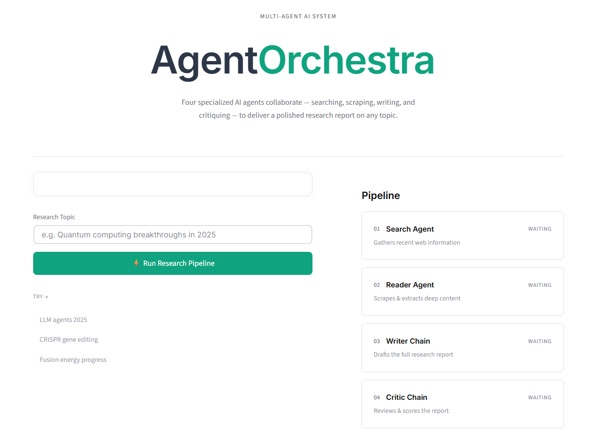

# Agent Orchestra
> An autonomous multi-agent research system that coordinates specialized AI agents to autonomously search, scrape, synthesize, and review information.


## 📌 Overview
**Agent Orchestra** is a powerful multi-agent AI system built to automate the heavy lifting of internet research. By coordinating four distinct AI agents—each with a specialized role—it mimics a real-world research team to deliver polished, accurate, and critically-reviewed research reports natively in your browser. 

Say goodbye to manual web searching, opening dozens of tabs, and compiling notes by hand. Just enter a topic, and watch the orchestrated agents collaborate entirely in real-time, surfacing deep insights and formatting them into a beautiful Markdown document.

## 💡 Motivation
In an era of information overload, finding high-quality, up-to-date information is time-consuming. Generic LLM queries often hallucinate or lack deep, current context, while manual research is tedious. I built Agent Orchestra to solve this by creating an autonomous pipeline that not only finds information but critically evaluates its own synthesis before presenting it, ensuring high-fidelity outputs for researchers, students, and professionals.

## ✨ Features
| Feature | Description |
|---------|-------------|
| **Search Agent 🔍** | Uses the Tavily Search API to gather the most recent, reliable, and highly relevant web data. |
| **Reader Agent 📄** | Intelligently targets the best URLs from the search results, deep-scraping them to extract dense context. |
| **Writer Chain ✍️** | Synthesizes the scraped data and drafts a comprehensive, well-structured Markdown report. |
| **Critic Chain 🧐** | An automated reviewer that critiques the generated report for accuracy, tone, and depth. |
| **Live Pipeline UI** | A fully customized, modern Streamlit interface featuring a step-by-step live progress visualizer. |
| **One-Click Export** | Download the final reviewed research report directly as a `.md` file. |

## 🛠️ Technologies
- **Frontend:** Streamlit, Custom CSS
- **Backend/AI:** Python 3.9+, LangChain, OpenAI API
- **Tools/APIs:** Tavily Search API, BeautifulSoup4, Requests
- **Deployment:** Streamlit Community Cloud

## ⚙️ How It Works
The system follows a sequential multi-agent graph architecture:
1. The user inputs a research topic via the Streamlit UI.
2. The **Search Agent** executes a targeted web search to build a preliminary context.
3. The **Reader Agent** takes the top results, navigates to the URLs, and scrapes the raw text.
4. The **Writer Chain** processes the combined search and scraped data into a structured draft.
5. Finally, the **Critic Chain** evaluates the draft, providing constructive feedback and a final score.



## 🚀 Installation

Follow these steps to run Agent Orchestra locally:

```bash
# 1. Clone the repository
git clone https://github.com/your-username/multi-agent-system.git
cd multi-agent-system

# 2. Set up a virtual environment (optional but recommended)
python -m venv .venv
source .venv/bin/activate  # On Windows: .venv\Scripts\activate

# 3. Install the dependencies
pip install -r requirements.txt
```

Create a `.env` file in the root directory to securely store your API keys:
```env
OPENAI_API_KEY="your-openai-api-key-here"
TAVILY_API_KEY="your-tavily-api-key-here"
```

Start the Streamlit development server:
```bash
streamlit run app.py
```

## 🎮 Usage
1. Open the app in your browser (typically `http://localhost:8501`).
2. Type a topic into the **Research Topic** input field (e.g., "Quantum computing breakthroughs in 2025").
3. Click the **"⚡ Run Research Pipeline"** button.
4. Watch the pipeline visualize progress as the agents run sequentially.
5. Review the generated insights and download the final Markdown report.

## 🚧 Challenges & Solutions
- **Challenge:** Managing state across multiple asynchronous LangChain agents in a Streamlit environment, which traditionally runs top-to-bottom synchronously.
  - **Solution:** Implemented robust `st.session_state` management to track the outputs of each agent independently, preventing the UI from resetting during long-running API calls.
- **Challenge:** LLM Hallucination and shallow summaries from standard search results.
  - **Solution:** Designed the "Reader Agent" specifically to fetch and parse actual webpage content via BeautifulSoup, grounding the "Writer Chain" in deep, factual text rather than snippets.

## 🎓 What I Learned
- Mastered building complex sequential agent pipelines using **LangChain**.
- Learned how to seamlessly integrate external APIs (like Tavily) as LangChain Tools.
- Gained experience overriding Streamlit's default CSS to create a highly polished, professional UI without needing React/Vue.
- Improved prompt engineering techniques by explicitly splitting writing and critiquing roles into distinct system prompts.

## 🔮 Future Improvements
- **Human-in-the-Loop Integration:** Allow users to pause the pipeline and provide guidance to the Writer Agent before finalization.
- **Multi-Source Scraping:** Upgrade the Reader Agent to process PDFs and academic papers concurrently.
- **Memory/Caching:** Implement vector database integration to cache past research topics and reduce API costs.

## 🎬 Demo
Live Demo: [https://agentorchestra.streamlit.app/](https://agentorchestra.streamlit.app/)


